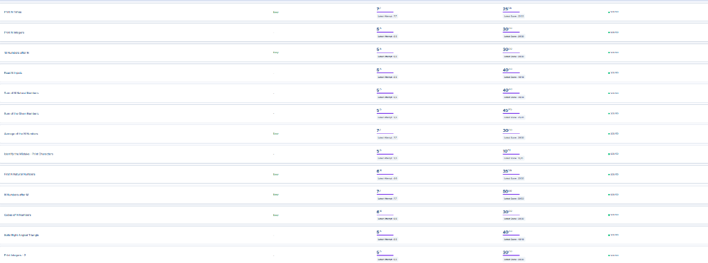
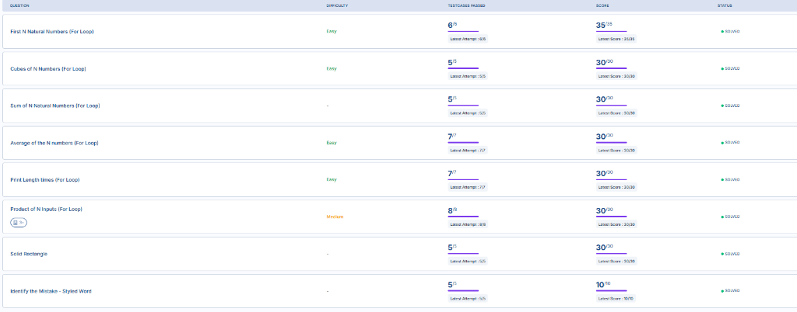
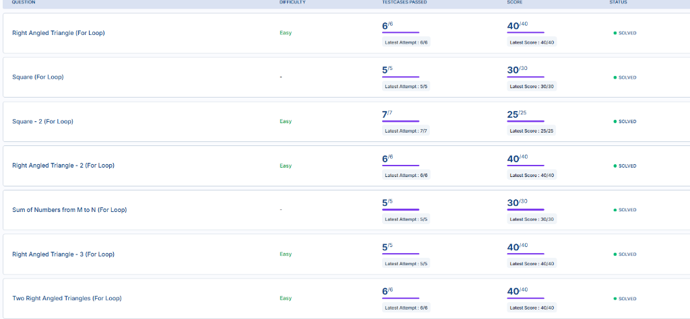
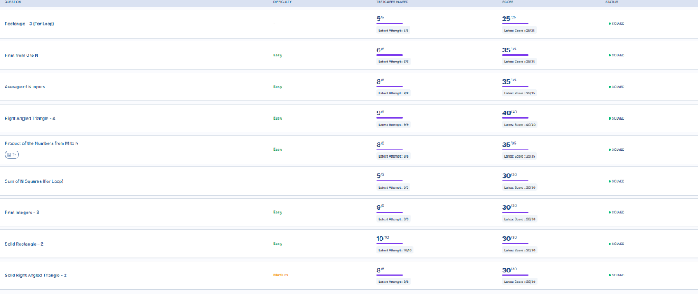
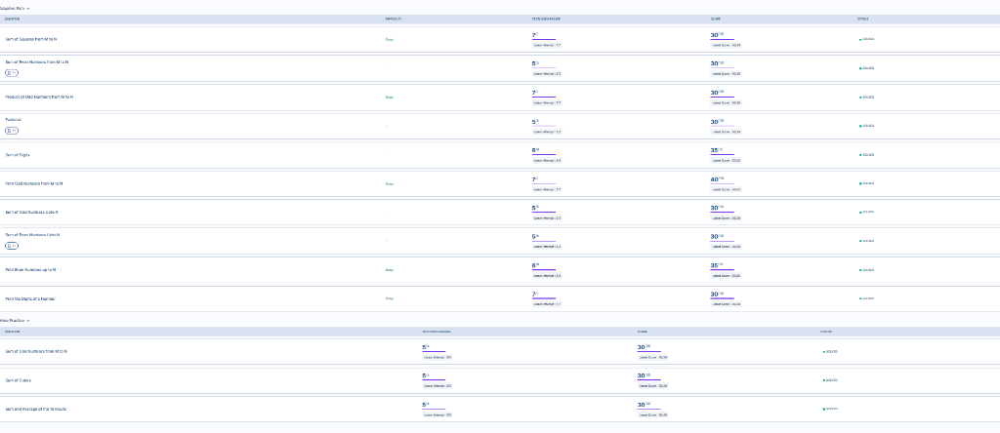
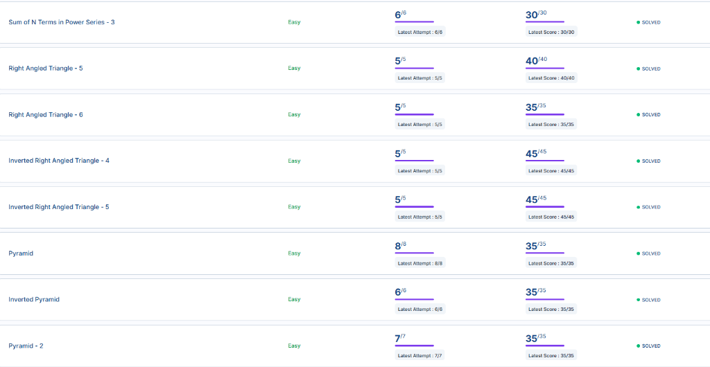

# 🐍 Python Loops Mastery

Welcome to the **Python Loops Mastery** repository! This project is designed to help you learn, practice, and master one of the most fundamental concepts in programming: **Loops**. 

Loops allow you to execute a block of code repeatedly, making your programs efficient, concise, and powerful.

---

## 📂 Day 1 Project Structure

All scripts have been organized into the **`day1/`** directory:

*   **[`day1/01_for_loops.py`](file:///C:/Users/shiak/.gemini/antigravity/scratch/python-loops-mastery/day1/01_for_loops.py)**: Learn how to iterate over ranges, lists, strings, and dictionaries using `for` loops.
*   **[`day1/02_while_loops.py`](file:///C:/Users/shiak/.gemini/antigravity/scratch/python-loops-mastery/day1/02_while_loops.py)**: Understand condition-based repetition, user input validation, and how to avoid infinite loops.
*   **[`day1/03_loop_control.py`](file:///C:/Users/shiak/.gemini/antigravity/scratch/python-loops-mastery/day1/03_loop_control.py)**: Master loop modifiers like `break`, `continue`, `pass`, and the unique Python `else` clause in loops.
*   **[`day1/04_nested_loops.py`](file:///C:/Users/shiak/.gemini/antigravity/scratch/python-loops-mastery/day1/04_nested_loops.py)**: Learn how to place loops inside loops to build grids, patterns, and matrices.
*   **[`day1/05_loop_challenges.py`](file:///C:/Users/shiak/.gemini/antigravity/scratch/python-loops-mastery/day1/05_loop_challenges.py)**: Test your knowledge with 5 practical challenges.
*   **[`day1/05_loop_challenges_solutions.py`](file:///C:/Users/shiak/.gemini/antigravity/scratch/python-loops-mastery/day1/05_loop_challenges_solutions.py)**: Solutions to the 5 challenges.

### 🌟 NxtWave Challenge Submissions:
*   [print_n_zeroes.py](file:///C:/Users/shiak/.gemini/antigravity/scratch/python-loops-mastery/day1/print_n_zeroes.py)
*   [print_1_to_n.py](file:///C:/Users/shiak/.gemini/antigravity/scratch/python-loops-mastery/day1/print_1_to_n.py)
*   [print_next_10_numbers.py](file:///C:/Users/shiak/.gemini/antigravity/scratch/python-loops-mastery/day1/print_next_10_numbers.py)
*   [read_and_print_n_numbers.py](file:///C:/Users/shiak/.gemini/antigravity/scratch/python-loops-mastery/day1/read_and_print_n_numbers.py)
*   [sum_first_n_numbers.py](file:///C:/Users/shiak/.gemini/antigravity/scratch/python-loops-mastery/day1/sum_first_n_numbers.py)
*   [sum_n_inputs.py](file:///C:/Users/shiak/.gemini/antigravity/scratch/python-loops-mastery/day1/sum_n_inputs.py)
*   [average_of_n_numbers.py](file:///C:/Users/shiak/.gemini/antigravity/scratch/python-loops-mastery/day1/average_of_n_numbers.py)
*   [print_1_to_n_while.py](file:///C:/Users/shiak/.gemini/antigravity/scratch/python-loops-mastery/day1/print_1_to_n_while.py)
*   [print_n_numbers_from_m.py](file:///C:/Users/shiak/.gemini/antigravity/scratch/python-loops-mastery/day1/print_n_numbers_from_m.py)
*   [print_cubes_1_to_n.py](file:///C:/Users/shiak/.gemini/antigravity/scratch/python-loops-mastery/day1/print_cubes_1_to_n.py)
*   [print_star_triangle.py](file:///C:/Users/shiak/.gemini/antigravity/scratch/python-loops-mastery/day1/print_star_triangle.py)
*   [print_m_to_n.py](file:///C:/Users/shiak/.gemini/antigravity/scratch/python-loops-mastery/day1/print_m_to_n.py)

---

## 📂 Day 2 Project Structure

All scripts for Day 2 are organized into the **`day2/`** directory:

*   **[`day2/print_triangle_pattern.py`](file:///C:/Users/shiak/.gemini/antigravity/scratch/python-loops-mastery/day2/print_triangle_pattern.py)**: Prints a right-angled triangle pattern of stars (`*`) of height N.
*   **[`day2/print_rectangle_pattern.py`](file:///C:/Users/shiak/.gemini/antigravity/scratch/python-loops-mastery/day2/print_rectangle_pattern.py)**: Prints a solid rectangle pattern of stars (`*`) with height M and width N.
*   **[`day2/print_number_square_pattern.py`](file:///C:/Users/shiak/.gemini/antigravity/scratch/python-loops-mastery/day2/print_number_square_pattern.py)**: Prints an N x N square pattern of row numbers.
*   **[`day2/print_triangle_with_pluses.py`](file:///C:/Users/shiak/.gemini/antigravity/scratch/python-loops-mastery/day2/print_triangle_with_pluses.py)**: Prints a triangle of stars (`* `) of height N-1, with a base of pluses (`+ `) of length N.

---

## 📂 Day 3 Project Structure

All scripts for Day 3 are organized into the **`day3/`** directory:

*   **[`day3/print_1_to_n.py`](file:///C:/Users/shiak/.gemini/antigravity/scratch/python-loops-mastery/day3/print_1_to_n.py)**: Prints numbers from 1 to N.
*   **[`day3/print_cubes_1_to_n.py`](file:///C:/Users/shiak/.gemini/antigravity/scratch/python-loops-mastery/day3/print_cubes_1_to_n.py)**: Prints the cube of each number from 1 to N.
*   **[`day3/sum_first_n_numbers.py`](file:///C:/Users/shiak/.gemini/antigravity/scratch/python-loops-mastery/day3/sum_first_n_numbers.py)**: Calculates the sum of numbers from 1 to N.
*   **[`day3/average_of_n_numbers.py`](file:///C:/Users/shiak/.gemini/antigravity/scratch/python-loops-mastery/day3/average_of_n_numbers.py)**: Calculates the average of numbers from 1 to N.
*   **[`day3/print_first_character.py`](file:///C:/Users/shiak/.gemini/antigravity/scratch/python-loops-mastery/day3/print_first_character.py)**: Reads a string and prints its first character as many times as the length of the string.
*   **[`day3/product_of_n_inputs.py`](file:///C:/Users/shiak/.gemini/antigravity/scratch/python-loops-mastery/day3/product_of_n_inputs.py)**: Reads N numbers and calculates their product.
*   **[`day3/print_rectangle_pattern_with_spaces.py`](file:///C:/Users/shiak/.gemini/antigravity/scratch/python-loops-mastery/day3/print_rectangle_pattern_with_spaces.py)**: Prints a rectangle of stars (`* `) of height M and width N using nested loops.
*   **[`day3/print_characters_with_hyphen.py`](file:///C:/Users/shiak/.gemini/antigravity/scratch/python-loops-mastery/day3/print_characters_with_hyphen.py)**: Reads a string and prints all its characters separated by hyphens.

---

## 📂 Day 4 Project Structure

All scripts for Day 4 are organized into the **`day4/`** directory:

*   **[`day4/print_triangle_pattern.py`](file:///C:/Users/shiak/.gemini/antigravity/scratch/python-loops-mastery/day4/print_triangle_pattern.py)**: Prints a right-angled triangle pattern of stars (`*`) of height N.
*   **[`day4/print_square_pattern.py`](file:///C:/Users/shiak/.gemini/antigravity/scratch/python-loops-mastery/day4/print_square_pattern.py)**: Prints a square of stars (`* `) of size N x N.
*   **[`day4/print_number_square.py`](file:///C:/Users/shiak/.gemini/antigravity/scratch/python-loops-mastery/day4/print_number_square.py)**: Prints an N x N square of row numbers using nested loops.
*   **[`day4/print_number_triangle.py`](file:///C:/Users/shiak/.gemini/antigravity/scratch/python-loops-mastery/day4/print_number_triangle.py)**: Prints a right-angled triangle pattern of row numbers.
*   **[`day4/cumulative_sum_m_to_n.py`](file:///C:/Users/shiak/.gemini/antigravity/scratch/python-loops-mastery/day4/cumulative_sum_m_to_n.py)**: Prints the running sum of all integers from M to N.
*   **[`day4/sum_of_numbers_m_to_n.py`](file:///C:/Users/shiak/.gemini/antigravity/scratch/python-loops-mastery/day4/sum_of_numbers_m_to_n.py)**: Calculates the sum of all integers from M to N.
*   **[`day4/print_star_triangle_with_pluses.py`](file:///C:/Users/shiak/.gemini/antigravity/scratch/python-loops-mastery/day4/print_star_triangle_with_pluses.py)**: Prints a triangle of stars (`* `) of height N-1 and a base of pluses (`+ `) of length N using nested loops.
*   **[`day4/print_double_number_triangle.py`](file:///C:/Users/shiak/.gemini/antigravity/scratch/python-loops-mastery/day4/print_double_number_triangle.py)**: Prints a right-angled triangle pattern of row numbers twice using nested loops.

---

## 📂 Day 5 Project Structure

All scripts for Day 5 are organized into the **`day5/`** directory:

*   **[`day5/print_number_rectangle.py`](file:///C:/Users/shiak/.gemini/antigravity/scratch/python-loops-mastery/day5/print_number_rectangle.py)**: Prints an M x N rectangle of row numbers.
*   **[`day5/print_two_triangles.py`](file:///C:/Users/shiak/.gemini/antigravity/scratch/python-loops-mastery/day5/print_two_triangles.py)**: Prints two identical star triangles (`* `) of height N.
*   **[`day5/print_0_to_n.py`](file:///C:/Users/shiak/.gemini/antigravity/scratch/python-loops-mastery/day5/print_0_to_n.py)**: Prints numbers from 0 to N.
*   **[`day5/product_of_numbers_m_to_n.py`](file:///C:/Users/shiak/.gemini/antigravity/scratch/python-loops-mastery/day5/product_of_numbers_m_to_n.py)**: Calculates the product of all integers from M to N.
*   **[`day5/sum_of_squares_1_to_n.py`](file:///C:/Users/shiak/.gemini/antigravity/scratch/python-loops-mastery/day5/sum_of_squares_1_to_n.py)**: Calculates the sum of squares of numbers from 1 to N.
*   **[`day5/print_n_to_1_reverse.py`](file:///C:/Users/shiak/.gemini/antigravity/scratch/python-loops-mastery/day5/print_n_to_1_reverse.py)**: Prints numbers from N down to 1.
*   **[`day5/print_plus_rectangle.py`](file:///C:/Users/shiak/.gemini/antigravity/scratch/python-loops-mastery/day5/print_plus_rectangle.py)**: Prints an M x N rectangle of pluses (`+ `).

---

## 📂 Day 6 Project Structure

All scripts for Day 6 are organized into the **`day6/`** directory:

*   **[`day6/sum_evens_m_to_n.py`](file:///C:/Users/shiak/.gemini/antigravity/scratch/python-loops-mastery/day6/sum_evens_m_to_n.py)**: Calculates the sum of all even numbers between M and N.
*   **[`day6/product_odds_m_to_n.py`](file:///C:/Users/shiak/.gemini/antigravity/scratch/python-loops-mastery/day6/product_odds_m_to_n.py)**: Calculates the product of all odd numbers between M and N.
*   **[`day6/factorial.py`](file:///C:/Users/shiak/.gemini/antigravity/scratch/python-loops-mastery/day6/factorial.py)**: Calculates the factorial of N.
*   **[`day6/sum_of_digits.py`](file:///C:/Users/shiak/.gemini/antigravity/scratch/python-loops-mastery/day6/sum_of_digits.py)**: Calculates the sum of all digits of the given number N.
*   **[`day6/print_odds_m_to_n.py`](file:///C:/Users/shiak/.gemini/antigravity/scratch/python-loops-mastery/day6/print_odds_m_to_n.py)**: Prints all odd numbers between M and N.
*   **[`day6/print_evens_1_to_n.py`](file:///C:/Users/shiak/.gemini/antigravity/scratch/python-loops-mastery/day6/print_evens_1_to_n.py)**: Prints all even numbers between 1 and N.
*   **[`day6/sum_evens_1_to_n.py`](file:///C:/Users/shiak/.gemini/antigravity/scratch/python-loops-mastery/day6/sum_evens_1_to_n.py)**: Calculates the sum of all even numbers between 1 and N.
*   **[`day6/sum_odds_1_to_n.py`](file:///C:/Users/shiak/.gemini/antigravity/scratch/python-loops-mastery/day6/sum_odds_1_to_n.py)**: Calculates the sum of all odd numbers between 1 and N.
*   **[`day6/print_digits_with_spaces.py`](file:///C:/Users/shiak/.gemini/antigravity/scratch/python-loops-mastery/day6/print_digits_with_spaces.py)**: Prints all digits of a number separated by spaces.
*   **[`day6/sum_odds_m_to_n.py`](file:///C:/Users/shiak/.gemini/antigravity/scratch/python-loops-mastery/day6/sum_odds_m_to_n.py)**: Calculates the sum of all odd numbers between M and N.
*   **[`day6/sum_of_cubes_1_to_n.py`](file:///C:/Users/shiak/.gemini/antigravity/scratch/python-loops-mastery/day6/sum_of_cubes_1_to_n.py)**: Calculates the sum of cubes of numbers from 1 to N.
*   **[`day6/sum_avg_10_inputs.py`](file:///C:/Users/shiak/.gemini/antigravity/scratch/python-loops-mastery/day6/sum_avg_10_inputs.py)**: Reads 10 numbers and prints their sum and average.

---

## 📂 Day 7 Project Structure

All scripts for Day 7 are organized into the **`day7/`** directory:

*   **[`day7/print_multiples_of_t.py`](file:///C:/Users/shiak/.gemini/antigravity/scratch/python-loops-mastery/day7/print_multiples_of_t.py)**: Prints all multiples of T between 1 and N.
*   **[`day7/print_inverted_triangle.py`](file:///C:/Users/shiak/.gemini/antigravity/scratch/python-loops-mastery/day7/print_inverted_triangle.py)**: Prints an inverted right-angled star triangle of height N.
*   **[`day7/print_a_and_z.py`](file:///C:/Users/shiak/.gemini/antigravity/scratch/python-loops-mastery/day7/print_a_and_z.py)**: Iterates over a string and prints characters that are 'a' or 'z'.
*   **[`day7/print_vowels.py`](file:///C:/Users/shiak/.gemini/antigravity/scratch/python-loops-mastery/day7/print_vowels.py)**: Iterates over a string and prints all vowels.
*   **[`day7/count_divisible_by_2_and_3.py`](file:///C:/Users/shiak/.gemini/antigravity/scratch/python-loops-mastery/day7/count_divisible_by_2_and_3.py)**: Counts how many numbers between 1 and N are divisible by both 2 and 3.
*   **[`day7/print_n_to_m_reverse.py`](file:///C:/Users/shiak/.gemini/antigravity/scratch/python-loops-mastery/day7/print_n_to_m_reverse.py)**: Prints numbers from N down to M.
*   **[`day7/print_string_reverse.py`](file:///C:/Users/shiak/.gemini/antigravity/scratch/python-loops-mastery/day7/print_string_reverse.py)**: Prints characters of a string in reverse order.
*   **[`day7/print_odds_reverse_n_to_m.py`](file:///C:/Users/shiak/.gemini/antigravity/scratch/python-loops-mastery/day7/print_odds_reverse_n_to_m.py)**: Prints odd numbers from N down to M.
*   **[`day7/print_divisible_by_2_and_3.py`](file:///C:/Users/shiak/.gemini/antigravity/scratch/python-loops-mastery/day7/print_divisible_by_2_and_3.py)**: Prints numbers between 1 and N that are divisible by both 2 and 3.
*   **[`day7/print_n_to_1_reverse.py`](file:///C:/Users/shiak/.gemini/antigravity/scratch/python-loops-mastery/day7/print_n_to_1_reverse.py)**: Prints numbers from N down to 1.
*   **[`day7/count_vowels.py`](file:///C:/Users/shiak/.gemini/antigravity/scratch/python-loops-mastery/day7/count_vowels.py)**: Counts the number of vowels in a string.
*   **[`day7/count_multiples_of_t.py`](file:///C:/Users/shiak/.gemini/antigravity/scratch/python-loops-mastery/day7/count_multiples_of_t.py)**: Counts how many multiples of T are between 1 and N.
*   **[`day7/sum_multiples_of_t_m_to_n.py`](file:///C:/Users/shiak/.gemini/antigravity/scratch/python-loops-mastery/day7/sum_multiples_of_t_m_to_n.py)**: Calculates the sum of all multiples of T between M and N.

### 📝 Day 7 Assignment Structure

*   **[`day7/assignment/product_multiples_of_3.py`](file:///C:/Users/shiak/.gemini/antigravity/scratch/python-loops-mastery/day7/assignment/product_multiples_of_3.py)**: Calculates the product of numbers divisible by 3 between M and N.
*   **[`day7/assignment/sum_of_kth_powers.py`](file:///C:/Users/shiak/.gemini/antigravity/scratch/python-loops-mastery/day7/assignment/sum_of_kth_powers.py)**: Calculates the sum of Kth powers of numbers from 1 to N.
*   **[`day7/assignment/count_divisible_by_6_and_8.py`](file:///C:/Users/shiak/.gemini/antigravity/scratch/python-loops-mastery/day7/assignment/count_divisible_by_6_and_8.py)**: Counts how many numbers between 1 and N are divisible by both 6 and 8.
*   **[`day7/assignment/inverted_triangle_with_pluses.py`](file:///C:/Users/shiak/.gemini/antigravity/scratch/python-loops-mastery/day7/assignment/inverted_triangle_with_pluses.py)**: Prints an inverted triangle of stars (first row) and pluses (rest of the rows).
*   **[`day7/assignment/combined_star_triangles.py`](file:///C:/Users/shiak/.gemini/antigravity/scratch/python-loops-mastery/day7/assignment/combined_star_triangles.py)**: Prints combined right-angled and inverted star triangles.
*   **[`day7/assignment/calculate_power.py`](file:///C:/Users/shiak/.gemini/antigravity/scratch/python-loops-mastery/day7/assignment/calculate_power.py)**: Calculates N raised to the power of M using a loop.
*   **[`day7/assignment/product_m_to_n.py`](file:///C:/Users/shiak/.gemini/antigravity/scratch/python-loops-mastery/day7/assignment/product_m_to_n.py)**: Calculates the product of all numbers between M and N.

---

## 📂 Day 8 Project Structure

All scripts for Day 8 are organized into the **`day8/`** directory:

*   **[`day8/sum_of_factors.py`](file:///C:/Users/shiak/.gemini/antigravity/scratch/python-loops-mastery/day8/sum_of_factors.py)**: Calculates the sum of all factors of N.
*   **[`day8/reverse_string_prepend.py`](file:///C:/Users/shiak/.gemini/antigravity/scratch/python-loops-mastery/day8/reverse_string_prepend.py)**: Reverses an input string by prepending characters one by one.
*   **[`day8/multiplication_table.py`](file:///C:/Users/shiak/.gemini/antigravity/scratch/python-loops-mastery/day8/multiplication_table.py)**: Prints the multiplication table for N from 1 to 10.
*   **[`day8/armstrong_number.py`](file:///C:/Users/shiak/.gemini/antigravity/scratch/python-loops-mastery/day8/armstrong_number.py)**: Checks if a number N is an Armstrong number.
*   **[`day8/greatest_number.py`](file:///C:/Users/shiak/.gemini/antigravity/scratch/python-loops-mastery/day8/greatest_number.py)**: Finds the greatest number among N inputs.
*   **[`day8/print_factors.py`](file:///C:/Users/shiak/.gemini/antigravity/scratch/python-loops-mastery/day8/print_factors.py)**: Prints all the factors of a number N on a single line.
*   **[`day8/perfect_number.py`](file:///C:/Users/shiak/.gemini/antigravity/scratch/python-loops-mastery/day8/perfect_number.py)**: Checks if N is a perfect number.
*   **[`day8/vowels_sequence.py`](file:///C:/Users/shiak/.gemini/antigravity/scratch/python-loops-mastery/day8/vowels_sequence.py)**: Prints all vowels found in N as a single string.
*   **[`day8/sum_of_powered_digits.py`](file:///C:/Users/shiak/.gemini/antigravity/scratch/python-loops-mastery/day8/sum_of_powered_digits.py)**: Calculates the sum of digits raised to the power of the number of digits.
*   **[`day8/print_factors_line_by_line.py`](file:///C:/Users/shiak/.gemini/antigravity/scratch/python-loops-mastery/day8/print_factors_line_by_line.py)**: Prints factors of N, each on a new line.
*   **[`day8/print_digit_2_triangle.py`](file:///C:/Users/shiak/.gemini/antigravity/scratch/python-loops-mastery/day8/print_digit_2_triangle.py)**: Prints a triangle pattern of repeated digit '2's.
*   **[`day8/sum_of_squares_of_series.py`](file:///C:/Users/shiak/.gemini/antigravity/scratch/python-loops-mastery/day8/sum_of_squares_of_series.py)**: Calculates the sum of squares of repeated digit series.
*   **[`day8/sum_of_series.py`](file:///C:/Users/shiak/.gemini/antigravity/scratch/python-loops-mastery/day8/sum_of_series.py)**: Calculates the sum of a repeated digit series (X + XX + XXX + ...).
*   **[`day8/check_vowels_count.py`](file:///C:/Users/shiak/.gemini/antigravity/scratch/python-loops-mastery/day8/check_vowels_count.py)**: Checks if a string has more than two vowels.
*   **[`day8/check_divisible_number.py`](file:///C:/Users/shiak/.gemini/antigravity/scratch/python-loops-mastery/day8/check_divisible_number.py)**: Checks if a number N is divisible by any single-digit number (2 to 9).
*   **[`day8/smallest_number.py`](file:///C:/Users/shiak/.gemini/antigravity/scratch/python-loops-mastery/day8/smallest_number.py)**: Finds the smallest number among N inputs.
*   **[`day8/multiples_of_6_m_to_n.py`](file:///C:/Users/shiak/.gemini/antigravity/scratch/python-loops-mastery/day8/multiples_of_6_m_to_n.py)**: Finds all numbers divisible by 6 between M and N.
*   **[`day8/sum_of_ones_series.py`](file:///C:/Users/shiak/.gemini/antigravity/scratch/python-loops-mastery/day8/sum_of_ones_series.py)**: Calculates the sum of a repeated series of 1s (1 + 11 + 111 + ...).
*   **[`day8/sum_of_twos_series.py`](file:///C:/Users/shiak/.gemini/antigravity/scratch/python-loops-mastery/day8/sum_of_twos_series.py)**: Calculates the sum of a repeated series of 2s (2 + 22 + 222 + ...).
*   **[`day8/multiples_of_9_m_to_n.py`](file:///C:/Users/shiak/.gemini/antigravity/scratch/python-loops-mastery/day8/multiples_of_9_m_to_n.py)**: Finds all numbers divisible by 9 between M and N.
*   **[`day8/count_digits_in_range.py`](file:///C:/Users/shiak/.gemini/antigravity/scratch/python-loops-mastery/day8/count_digits_in_range.py)**: Counts the total number of digits of all numbers between M and N.
*   **[`day8/alternating_even_powers_sum.py`](file:///C:/Users/shiak/.gemini/antigravity/scratch/python-loops-mastery/day8/alternating_even_powers_sum.py)**: Calculates the alternating sum of even powers of x.
*   **[`day8/right_aligned_star_triangle.py`](file:///C:/Users/shiak/.gemini/antigravity/scratch/python-loops-mastery/day8/right_aligned_star_triangle.py)**: Prints a right-aligned star triangle.
*   **[`day8/right_aligned_star_triangle_spaces.py`](file:///C:/Users/shiak/.gemini/antigravity/scratch/python-loops-mastery/day8/right_aligned_star_triangle_spaces.py)**: Prints a right-aligned star triangle with double-space formatting.
*   **[`day8/inverted_number_triangle.py`](file:///C:/Users/shiak/.gemini/antigravity/scratch/python-loops-mastery/day8/inverted_number_triangle.py)**: Prints an inverted, right-aligned triangle of numbers.
*   **[`day8/inverted_number_triangle_spaces.py`](file:///C:/Users/shiak/.gemini/antigravity/scratch/python-loops-mastery/day8/inverted_number_triangle_spaces.py)**: Prints an inverted, right-aligned triangle of numbers with custom spacing.
*   **[`day8/right_aligned_star_pyramid.py`](file:///C:/Users/shiak/.gemini/antigravity/scratch/python-loops-mastery/day8/right_aligned_star_pyramid.py)**: Prints a right-aligned star pyramid.
*   **[`day8/inverted_star_pyramid.py`](file:///C:/Users/shiak/.gemini/antigravity/scratch/python-loops-mastery/day8/inverted_star_pyramid.py)**: Prints an inverted star pyramid.
*   **[`day8/right_aligned_number_pyramid.py`](file:///C:/Users/shiak/.gemini/antigravity/scratch/python-loops-mastery/day8/right_aligned_number_pyramid.py)**: Prints a right-aligned number pyramid.

---

## 📂 Day 9 Project Structure

All scripts for Day 9 are organized into the **`day9/`** directory:

*   **[`day9/number_pyramid.py`](file:///C:/Users/shiak/.gemini/antigravity/scratch/python-loops-mastery/day9/number_pyramid.py)**: Prints a centered pyramid of numbers.
*   **[`day9/star_diamond.py`](file:///C:/Users/shiak/.gemini/antigravity/scratch/python-loops-mastery/day9/star_diamond.py)**: Prints a diamond pattern made of stars.
*   **[`day9/half_diamond.py`](file:///C:/Users/shiak/.gemini/antigravity/scratch/python-loops-mastery/day9/half_diamond.py)**: Prints a left-aligned half diamond star pattern.
*   **[`day9/inverted_star_triangle_plus.py`](file:///C:/Users/shiak/.gemini/antigravity/scratch/python-loops-mastery/day9/inverted_star_triangle_plus.py)**: Prints an inverted star triangle topped with pluses.
*   **[`day9/butterfly_pattern_top.py`](file:///C:/Users/shiak/.gemini/antigravity/scratch/python-loops-mastery/day9/butterfly_pattern_top.py)**: Prints the top half of a star butterfly pattern.
*   **[`day9/double_star_pyramid.py`](file:///C:/Users/shiak/.gemini/antigravity/scratch/python-loops-mastery/day9/double_star_pyramid.py)**: Prints two adjacent star pyramids.
*   **[`day9/butterfly_star_pattern.py`](file:///C:/Users/shiak/.gemini/antigravity/scratch/python-loops-mastery/day9/butterfly_star_pattern.py)**: Prints a full butterfly pattern made of stars.
*   **[`day9/half_diamond_plus_hash.py`](file:///C:/Users/shiak/.gemini/antigravity/scratch/python-loops-mastery/day9/half_diamond_plus_hash.py)**: Prints a right-aligned half diamond made of pluses and hashes.
*   **[`day9/half_diamond_number.py`](file:///C:/Users/shiak/.gemini/antigravity/scratch/python-loops-mastery/day9/half_diamond_number.py)**: Prints a left-aligned half diamond of numbers.
*   **[`day9/star_pyramid.py`](file:///C:/Users/shiak/.gemini/antigravity/scratch/python-loops-mastery/day9/star_pyramid.py)**: Prints a centered star pyramid.
*   **[`day9/inverted_star_pyramid_spaces.py`](file:///C:/Users/shiak/.gemini/antigravity/scratch/python-loops-mastery/day9/inverted_star_pyramid_spaces.py)**: Prints a centered inverted star pyramid.
*   **[`day9/count_digits_to_n.py`](file:///C:/Users/shiak/.gemini/antigravity/scratch/python-loops-mastery/day9/count_digits_to_n.py)**: Counts the total number of digits of all numbers from 1 to N.
*   **[`day9/alternating_odd_powers_sum.py`](file:///C:/Users/shiak/.gemini/antigravity/scratch/python-loops-mastery/day9/alternating_odd_powers_sum.py)**: Calculates the alternating sum of odd powers of X.
*   **[`day9/check_more_than_two_factors.py`](file:///C:/Users/shiak/.gemini/antigravity/scratch/python-loops-mastery/day9/check_more_than_two_factors.py)**: Checks if N has strictly more than two factors.
*   **[`day9/stacked_star_triangles.py`](file:///C:/Users/shiak/.gemini/antigravity/scratch/python-loops-mastery/day9/stacked_star_triangles.py)**: Prints two stacked star triangles.
*   **[`day9/number_diamond.py`](file:///C:/Users/shiak/.gemini/antigravity/scratch/python-loops-mastery/day9/number_diamond.py)**: Prints a centered diamond pattern of numbers.
*   **[`day9/inverted_right_aligned_star_triangle.py`](file:///C:/Users/shiak/.gemini/antigravity/scratch/python-loops-mastery/day9/inverted_right_aligned_star_triangle.py)**: Prints an inverted, right-aligned star triangle.
*   **[`day9/inverted_hollow_pyramid.py`](file:///C:/Users/shiak/.gemini/antigravity/scratch/python-loops-mastery/day9/inverted_hollow_pyramid.py)**: Prints an inverted hollow star pyramid.

---

## 🏆 NxtWave Portal Progress

### Day 1 Progress:


### Day 3 Progress:


### Day 4 Progress:


### Day 5 Progress:


### Day 6 Progress:


### Day 8 Progress:


---

## 🚀 How to Run the Code

1.  Make sure you have **Python** installed on your system.
2.  Open your terminal or command prompt.
3.  Navigate to the `day1` directory:
    ```bash
    cd day1
    ```
4.  Run any of the scripts using the Python command:
    ```bash
    python <filename>.py
    ```
