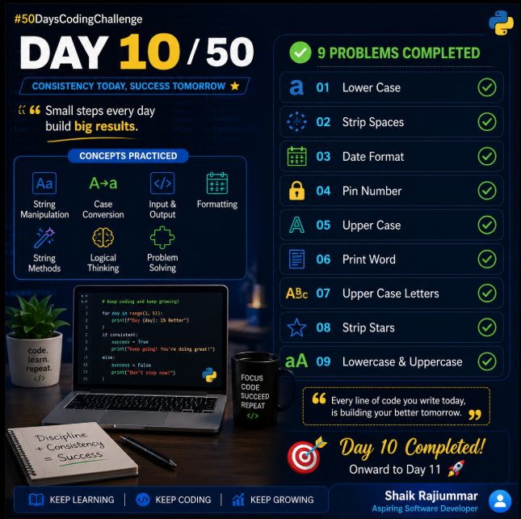

# Strings - Day 1 (50 Days Challenge Day 10)

This directory contains the Python string challenges solved on Strings Day 1.

## 📂 Challenges List

*   **[`lowercase_string.py`](lowercase_string.py)**: Converts an input string to lowercase.
*   **[`trim_string.py`](trim_string.py)**: Trims leading and trailing spaces of a string.
*   **[`format_date.py`](format_date.py)**: Formats a hyphen-separated date with slashes.
*   **[`validate_pin.py`](validate_pin.py)**: Checks if an input PIN consists entirely of digits.
*   **[`check_uppercase.py`](check_uppercase.py)**: Checks if an input string consists entirely of uppercase letters.
*   **[`extract_alphabets.py`](extract_alphabets.py)**: Filters and prints only alphabetic characters from a string.
*   **[`extract_uppercase.py`](extract_uppercase.py)**: Filters and prints only uppercase letters from a string.
*   **[`trim_stars.py`](trim_stars.py)**: Trims leading and trailing asterisks from a string.
*   **[`lowercase_uppercase.py`](lowercase_uppercase.py)**: Converts an input string to lowercase and uppercase, and prints both.
*   **[`check_python_file.py`](check_python_file.py)**: Checks if a filename ends with the ".py" extension.
*   **[`validate_password.py`](validate_password.py)**: Validates if a password contains uppercase, lowercase, and digits.
